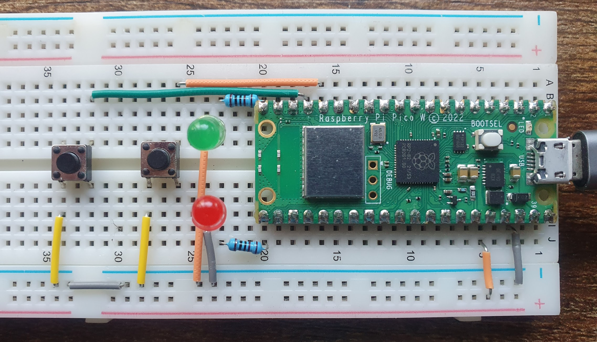
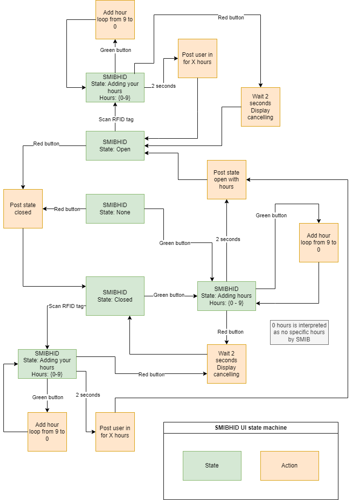

# SMIBHID
## Overview
SMIBHID is the So Make It Bot Human Interface Device and definitely not a mispronunciation of any insults from a popular 90s documentary detailing the activites of the Jupiter Mining Core.

This device run on a Raspberry Pi Pico W and provides physical input and output to humans for the SMIB project; Buttons, LEDs, that sort of thing.

Space_open and space_closed LEDs show current state as set on the S.M.I.B. slack server. If the space_state is set to None on the server i.e. no state has been specifically set, then both LEDs will be off.

Press the space_open or space_closed buttons to call the smib server endpoint appropriately. The target state LED will flash to show it's attempting to communicate and confirm successful state update to provide feedback to the user. In normal operation the request should complete and update the LED in a couple of seconds.

## Features
- Space open and closed buttons with LED feedback that calls the S.M.I.B. space_open/space_closed endpoint
- Press the open button multiple times to set the number of hours the space will be open for
- LED flashes while trying to set state so you know it's trying to do something
- Confirms the space state after change by calling space_state
- Regularly polls for space state (polling period configurable in config.py) and updates the SMIBHID status appropriately to sync with other space state controls
- Flashes both space state LEDs at 2Hz if space state cannot be determined
- 2x16 character LCD display support
- Error information shown on connected displays where configured in modules using ErrorHandler class
- UI Logger captures timestamps of button presses and uploads to SMIB for logging and review of usage patterns
- Space open relay pin optionally sets a GPIO to high or low when the space is open
- Web server for admin functions - at present only provides API for version and MAC address (Check info log messages or DHCP server for IP and default port is 80)

## Circuit diagram
### Pico W Connections

### Pico W pinout

### Example breadboard build

### Example prototype build

## Hardware
Below is a list of hardware ad links for my specific build:
- [Raspberry Pi Pico W](https://thepihut.com/products/raspberry-pi-pico-w?variant=41952994754755)
- [Prototype board](https://thepihut.com/products/pico-proto-pcb?variant=41359085568195)
- [LED push button switch - Red](https://thepihut.com/products/rugged-metal-pushbutton-with-red-led-ring?variant=27740444561)
- [LED push button switch - Green](https://thepihut.com/products/rugged-metal-pushbutton-with-green-led-ring?variant=27740444625)
- [JST connectors](https://www.amazon.co.uk/dp/B07449V33P)
- [2x16 Character I2C display](https://thepihut.com/products/lcd1602-i2c-module?variant=42422810083523)

## Deployment
Copy the files from the smibhib folder into the root of a Pico W running Micropython (minimum Pico W Micropython firmware v1.22.2 https://micropython.org/download/RPI_PICO_W/) and update values in config.py as necessary

### Configuration
- Ensure the pins for the space open/closed LEDs and buttons are correctly specified for your wiring
- Configure I2C pins for the display if using, display will detect automatically or disable if not found
- Populate Wifi SSID and password
- Configure the webserver hostname/IP and port as per your smib.webserver configuration
- Set the space state poll frequency in seconds (>= 5), set to 0 to disable the state poll
- Configure the space open relay pin if required or else set to None, also choose if space open sets pin high or low

## Onboard status LED
The LED on the Pico W board is used to give feedback around network connectivity if you are not able to connect to the terminal output for logs.
* 1 flash at 2 Hz: successful connection
* 2 flashes at 2 Hz: failed connection
* Constant 4Hz flash: in backoff period before retrying connection
* No LED output: normal operation

## Developers
SMIB uses a class abstracted approach running an async loop using the built in asyncio library, a static copy of the uaiohttpclient for making async requests and my custom logging module.

### Logging
#### Log level
Set the LOG_LEVEL value in config.py for global log level output configuration where: 0 = Disabled, 1 = Critical, 2 = Error, 3 = Warning, 4 = Info

Example: `LOG_LEVEL = 2`

#### Log Handlers
Populate the LOG_HANDLERS list in config.py with zero or more of the following log output handlers (case sensitive): "Console", "File"

Example: `LOG_HANDLERS = ["Console", "File"]`

#### Log file max size
Set the LOG_FILE_MAX_SIZE value in config.py to set the maximum size of the log file in bytes before rotating. The log rotater will create a maximum of 2 files at this size, so configure appropiately for anticpated flash free space.

Example: `LOG_FILE_MAX_SIZE = 10240`

### Error handling
Create a new instance of the ErrorHandling class in a module to register a list of possible errors for that module and enabled or disable them for display on connected screens using class methods. See the space state module for an example of implementation.

### Adding functionality
Refer to the [S.M.I.B. contribution guidelines](https://github.com/somakeit/S.M.I.B./contribute) for more info on contributing.

Use existing space state buttons, lights, slack API wrapper and watchers as an example for how to implement:
- Create or use an existing (such as button) appropriate module and class with coroutine to watch for input or other appropriate event
- In the HID class
  - Instantiate the object instance, passing an asyncio event to the watcher and add the watcher coroutine to the loop
  - Configure another coroutine to watch for the event and take appropriate action on event firing
  - Add new API endpoint methods as needed as the API is upgraded to support them
- Display drivers can be added by creating a new display driver module
  - Ensure the driver registers itself with the driver registry, use LCD1602 as an example
  - Import the new driver module in display.py
  - Update the config.py file to include the option for your new driver
- UIState machine
  - A state machine exists and can be extended by various modules such as space_state to manage the state of the buttons and display output
  - The current state instance is held in hid.ui_state_instance
  - Enter a new UI state by calling the transition_to() method on a UIstate instance and pass any arguments needed by that state
  - You will need to pass any core objects needed by the base UIState class and apply using super() as normal. These are currently HID (for managing the current state instance) and SpaceState so that the open and close buttons are available in all UIs with default space open/closed behaviour.

### Web server
The admin web interface is hosted by a customised version of [tinyweb](https://github.com/belyalov/tinyweb) server which is a flask like implementation of a asyncio web server in MicroPython.
The website configuration and API definition is built out from the website.py module and all HTML/CSS/JS etc lives in the www subfolder.

### UI State diagram
The space state UI state machine is described in this diagram:

## Version
Ensure that the `HID` class version attribute is updated to match the version in `pyproject.toml`

> [!IMPORTANT]
> This version needs to match the release when it goes into the `master` branch.
